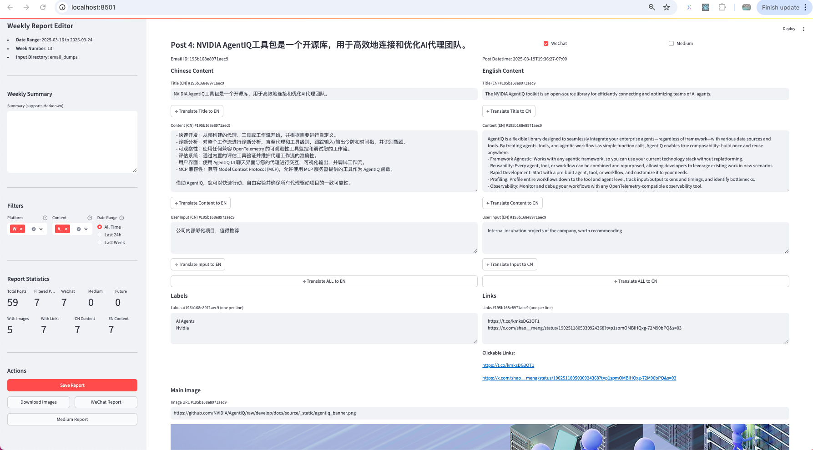

# FunSense AI Tapas

This project provides functionality to automatically analyze and tag Gmail emails based on their content. It uses the Gmail API to retrieve emails, analyze their content, and add appropriate labels. It also includes a weekly report generator for summarizing email content.

## Features

- Retrieve emails from Gmail account by date range
- Analyze email content using LLM-based processing
- Automatically tag emails with relevant labels
- Generate weekly reports from analyzed emails
- Bi-directional translation between Chinese and English content
- Twitter content crawling and conversion to markdown

## Setup

1. **Create Google Cloud Project**
   - Go to [Google Cloud Console](https://console.cloud.google.com)
   - Create a new project
   - Enable the Gmail API
   - Create OAuth 2.0 credentials
   - Download the credentials and save as `credentials.json` in the project root

2. **Install Dependencies**
   ```bash
   pip install -r requirements.txt
   ```

3. **First Run**
   - Run the main script:
     ```bash
     python main_cli.py dump-emails-by-date 2025-01-01 2025-01-31 --output-dir email_dumps --verbose
     ```
   - On first run, it will open a browser window for OAuth authentication
   - Grant the required permissions
   - The authentication token will be saved for future use

## Project Structure

```
├── gmail_api/
│   ├── auth.py           # Authentication handling
│   ├── email_dumper.py   # Email retrieval and storage
│   └── email_analyzer.py # Email content analysis with LLM
├── weekly_report/
│   └── report_app.py     # Streamlit app for weekly reports
├── twitter/
│   └── twitter_crawler.py # Twitter content crawling
├── main_cli.py           # Main CLI entry point using Typer
├── requirements.txt      # Project dependencies
└── README.md             # This file
```

## Command-Line Interface

The project uses Typer to provide a command-line interface with the following main commands:

- `dump-emails-by-date`: Retrieve emails within a date range
- `analyze-emails-by-date`: Analyze email content using LLM
- `generate-labels-by-date`: Generate labels for emails using few-shot learning
- `weekly-report`: Launch Streamlit app for weekly report generation
- `crawl-tweet`: Crawl a tweet and convert to markdown

Run `python main_cli.py --help` for more information on available commands.

## Weekly Report Generator

The weekly report generator is a Streamlit app that allows you to:

- View and edit analyzed email content
- Select posts for different platforms (WeChat, Medium)
- Translate content between Chinese and English
- Generate markdown reports for different platforms
- Add custom content and images to posts

## Few-Shot Learning for Labels

The system uses few-shot learning to generate appropriate labels for emails:

- Examples are stored in a JSON file
- Labels are organized in a hierarchical structure
- The system ensures balanced representation across labels

## usage:
 # not include the end
 - python main_cli.py dump-emails-by-date 2025-01-04 2025-01-12 --output-dir email_dumps --verbose
 - python main_cli.py analyze-emails-by-date 2025-01-04 2025-01-12 --input-dir email_dumps  --verbose
 - streamlit run weekly_report/report_app.py -- --start-date 2025-01-12 --end-date 2025-01-20 --input-dir email_dumps

## Contributing

Feel free to submit issues and enhancement requests!
